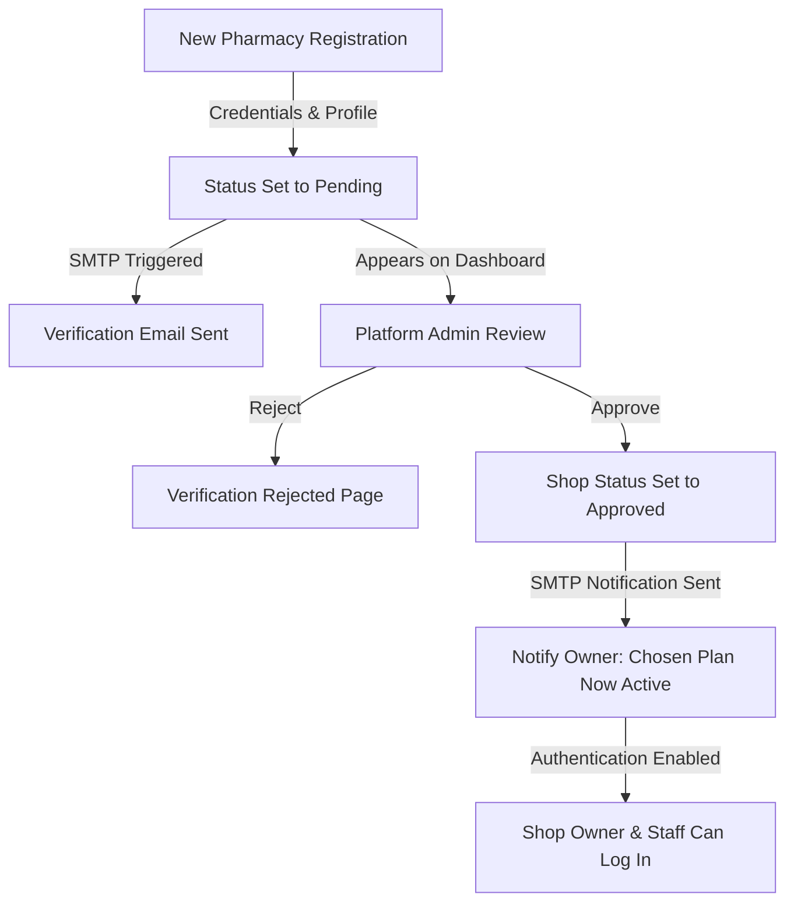

# StockEasy - Smart Pharmacy Stock & Expiry Management System

StockEasy is a modern, secure, and multi-tenant SaaS application designed specifically for retail pharmacies, chemists, and druggists in India to manage their medicine inventory, automate GST-compliant billing, eliminate medicine expiry losses, and communicate directly with platform administrators.

---

## 🏗️ Architecture & Tech Stack

StockEasy is built on a robust, scalable, and responsive architecture:

*   **Frontend Framework:** Next.js (App Router, React Server Components, Turbopack compiler)
*   **Styling & UI:** Tailwind CSS for maximum responsiveness, Shadcn UI components, and Lucide React icons.
*   **Database:** Supabase (PostgreSQL with relational foreign key structures and indexing).
*   **Authentication & Sessions:** Next.js edge-level Route Handlers / Proxy (`src/proxy.ts`) parsing JWT Session cookies (`jose` JWT verification) to isolate database queries by tenant ID.
*   **Email & SMTP Engine:** Nodemailer with an active fallback simulation for verification, broadcasts, and onboarding alerts.

---

## 📂 Project Structure

```text
stock-easy/
├── supabase/                 # Supabase configuration & database migrations
│   └── migrations/           # SQL migration files (tables, triggers, policies)
├── src/
│   ├── app/                  # Next.js App Router route segments
│   │   ├── (admin)/          # Group route for platform admin features
│   │   │   └── admin/        # Sub-routes (/admin/dashboard, /admin/support, etc.)
│   │   ├── (shop)/           # Group route for pharmacy dashboard & workflows
│   │   │   ├── dashboard/    # Shop overview
│   │   │   ├── billing/      # POS Billing terminal
│   │   │   ├── inventory/    # Medicine stock list
│   │   │   └── ...           # Settings, analytics, history logs
│   │   ├── api/              # Route endpoints (authentication, uploads)
│   │   ├── login/            # Shop owner & staff login page
│   │   ├── register/         # New shop onboarding request form
│   │   └── page.tsx          # Public marketing & landing page
│   ├── components/           # React client components grouped by feature
│   │   ├── admin/            # Admin analytics, shops dashboard, support chat
│   │   ├── auth/             # Login and register forms
│   │   ├── billing/          # GST invoice builder & print terminal
│   │   ├── layout/           # Sidebar, navbar, & Notification Bell components
│   │   ├── ui/               # Reusable UI controls (Buttons, Cards, Badges)
│   │   └── ...               # Analytics, AI chat, stock forms
│   ├── lib/                  # Helper utilities, constants, & backend logic
│   │   ├── actions/          # Next.js Server Actions (AI, Analytics, Support, POS)
│   │   ├── admin/            # Administrative verification and email actions
│   │   ├── auth/             # Auth encryption, roles check, & sessions helper
│   │   ├── supabase/         # Supabase connection init (server/client)
│   │   ├── constants.ts      # Global configurations & routing pathways
│   │   ├── mail.ts           # SMTP transporter & Nodemailer helper
│   │   └── utils.ts          # Invoice formatters & CSS class merger
│   ├── types/                # Typescript type definitions
│   └── proxy.ts              # Next.js 16 Edge proxy (replaces middleware.ts)
```

---

## 🔑 User Roles & Detailed Features

### A. Pharmacy Shop Owners (Shoppers)
Shop Owners have complete administrative power over their pharmacy workspace:
1.  **Workplace KPIs:** A detailed, real-time dashboard displaying Today's Sales, Low Stock Warnings, Near Expiry Alerts (30/60/90 days), and Expiry Losses.
2.  **GST POS Billing counter:** GST-compliant billing interface calculating CGST + SGST (5%, 12%, 18%, etc.). Features batch selection dropdowns displaying expiries, auto price fetching, printed bill templates (including customizable doctor names), and automatic inventory deduction.
3.  **Inventory (FEFO-driven):** Advanced medicine entry system implementing **FEFO (First Expiry, First Out)** logic. Medicines closest to expiry are queued to sell first.
4.  **Advanced Analytics:** Expiry loss projections, monthly sales charts (Recharts integration), low stock lists, and a *Dead Stock Tracker* for slow-moving stock.
5.  **AI Assistant Chat:** An inline chat assistant (`%%bqsql` / Gemini context-driven) to query inventory, summarize monthly sales, or ask questions about medicine compositions.
6.  **Staff Management:** Onboard, manage, and delete counter staff accounts.
7.  **Workspace Settings:** Toggle subscription auto-renew, upgrade subscription plans, and update pharmacy profiles.
8.  **Customer Service Tab:** Open support tickets and chat live in real time with central admin (chat thread locks once the issue is closed by the admin).

### B. Shop Staff Accounts
Staff accounts are built for billing counters and inventory stock managers:
*   **POS Terminal:** Access to bill counter screens and bills history lookup.
*   **Stock Ledger:** Access to add, search, and edit medicine batches.
*   **AI Assistant:** Permitted to query the AI inventory helper.
*   **Role Limitations:** Strictly blocked from seeing settings, financial subscription/billing layouts, staff onboarding, or deactivation controls.

### C. Central Platform Administrators
Admins control platform settings and monitor systems health:
1.  **Verification Desk:** Audit newly registered pharmacies. View license details, store details, contact info, and click to approve/reject access.
2.  **Platform Analytics:** Track total registered shops, total active users, monthly subscription growth rates, and shop growth charts.
3.  **Support Tickets Hub:** WhatsApp Web-style interface showing all open tickets, shop names, and owner details on the left, and a live chat screen on the right. Allows admins to assist owners and close/lock tickets when resolved.
4.  **Broadcast Center:** In-app Notification (bell icon with unread indicator badge & ping animations) and/or SMTP Email broadcasts. Can target "All platform users", "All admins", "All shop owners", or a custom email.
5.  **Systems Maintenance Toggle:** Super-admin-only switch that locks out non-admin users and redirects them to a maintenance page. Includes a secure *Central Admin Gateway* bypass portal to log in.

---

## 📈 Onboarding Journey & Pharmacy Flow



---

## 🔮 Future Scope & Product Updates
1.  **National Drug Registry Integration:** Connect with Indian medicine APIs (CIMS/MIMS) to auto-fill medicine compositions, salt descriptions, and side-effects.
2.  **SMS Gateway Integration:** Integrate Twilio or Msg91 to dispatch digital bill receipts and low-stock/refill reminders directly to customers' mobile numbers.
3.  **Offline-first POS Application:** Package the billing POS counter as an offline desktop application syncing local database transactions to Supabase once an internet connection is restored.
4.  **Drug Interaction Warnings:** Display alerts during billing if items in the cart have adverse chemical interactions with each other.

---

## ⚠️ Limitations
*   **Internet Dependencies:** Requires a stable internet connection to query Supabase DB, handle NextJS server actions, and query the Gemini AI assistant.
*   **SMTP Service:** Relies on third-party host credentials (`SMTP_HOST`, `SMTP_PORT`) to dispatch verification and broadcast emails.

---

## 🎯 Target Audience
*   **Independent Retail Pharmacies:** Chemists and drug stores across India.
*   **Chain Pharmacies:** Group networks looking to centralize inventory monitoring, dead stock consolidation, and platform-wide analytics.
*   **Hospital Pharmacies:** Outpatient dispensaries wanting automated FEFO queues and fast counter billing.
